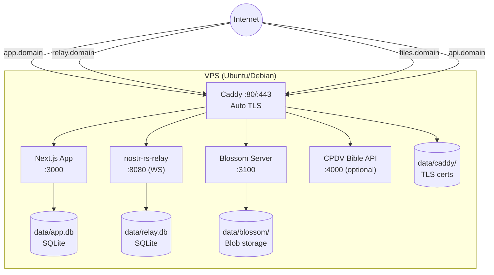

# Infrastructure

## Overview
BibleHodl runs as a Docker Compose stack with four services behind a Caddy reverse proxy. Each community self-hosts the entire stack on a single VPS (2–4 vCPU, 4GB RAM, ~$5–15/mo).

## How It Fits
Caddy is the entry point — it terminates TLS and routes subdomains to the appropriate container. All persistent data lives in a single `data/` directory (SQLite databases + blob storage), making backup a single `tar` command.

## Key Files
- `docker-compose.yml` — Service definitions for app, relay, blossom, caddy
- `Caddyfile` — Subdomain routing and TLS config
- `config/relay-config.toml` — nostr-rs-relay TOML configuration
- `config/blossom-config.yml` — Blossom server configuration
- `.env` / `.env.example` — Community-specific environment variables

## Architecture

## Status
Implemented — Docker Compose stack with all four services and Caddy routing.
