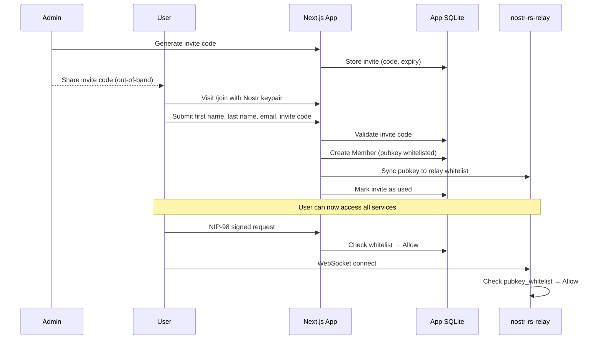

# Authentication

## Overview
Users authenticate with a Nostr keypair (nsec/npub). Access is gated by an invite code system — an admin generates a one-time code, shares it out-of-band, and the user redeems it during registration. Once registered, the user's pubkey is whitelisted across all services.

## How It Fits
The Next.js app handles registration and stores the whitelist in its SQLite database via Prisma. On registration, the pubkey is also synced to the nostr-rs-relay whitelist (direct SQLite write). Blossom enforces access via kind 24242 signed auth events. All three services reject non-whitelisted users.

## Key Files
- `app/lib/auth.ts` — NIP-98 signature verification, pubkey extraction from requests
- `app/lib/nostr.ts` — Key generation, nsec import, Nostr constants
- `app/lib/membership.ts` — Whitelist checks (`verifyAccess`, `isMemberOfAnyTeam`)
- `app/lib/relay-sync.ts` — Syncs pubkeys to/from the relay whitelist
- `prisma/schema.prisma` — `Member` and `Invite` models

## Architecture

## Status
Implemented — invite-based registration, NIP-98 auth, whitelist enforcement across app and relay.
