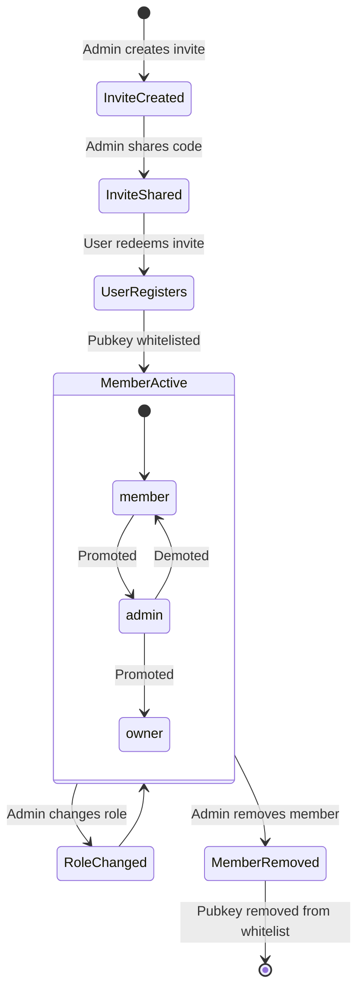

# Team Management

## Overview
Teams are the organizational unit in BibleHodl. Each team has members with roles (owner, admin, member) and its own invite codes. Admins can create teams, invite members, and manage roles through the app's admin panel.

## How It Fits
Teams and members are stored in the Next.js app's SQLite database via Prisma. When a member is added or removed, their pubkey is synced to the nostr-rs-relay whitelist so they gain or lose access to the relay and all Nostr-based features.

## Key Files
- `app/lib/team-service.ts` — CRUD for teams, members, invites (client-side API calls)
- `app/lib/membership.ts` — Server-side membership checks and access verification
- `app/lib/relay-sync.ts` — Pubkey whitelist sync to relay
- `prisma/schema.prisma` — `Team`, `Member`, `Invite` models

## Architecture

## Status
Implemented — team CRUD, role management, invite codes, relay whitelist sync.
