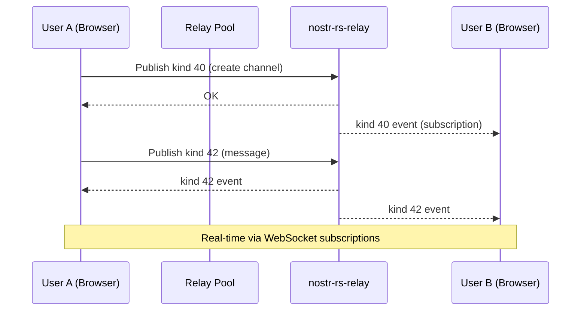

# Chat

## Overview
Chat uses NIP-28 public channels on the community's private Nostr relay. Users create channels (kind 40) and send messages (kind 42). Messages are delivered in real-time via WebSocket relay subscriptions.

## How It Fits
All chat data lives on the nostr-rs-relay — no server-side database needed. The Next.js app subscribes to the relay via a WebSocket pool and renders messages client-side. Only whitelisted pubkeys can read or write.

## Key Files
- `app/lib/chat-service.ts` — Create channels, send messages, subscribe to channel events
- `app/lib/nostr.ts` — Kind constants (40, 41, 42), event creation helpers
- `app/lib/relay-pool.ts` — WebSocket connection pool to the relay
- `app/lib/store.ts` — `Channel` and `ChatMessage` interfaces, Zustand state

## Architecture

## Status
Implemented — channel creation, messaging, real-time subscriptions.
