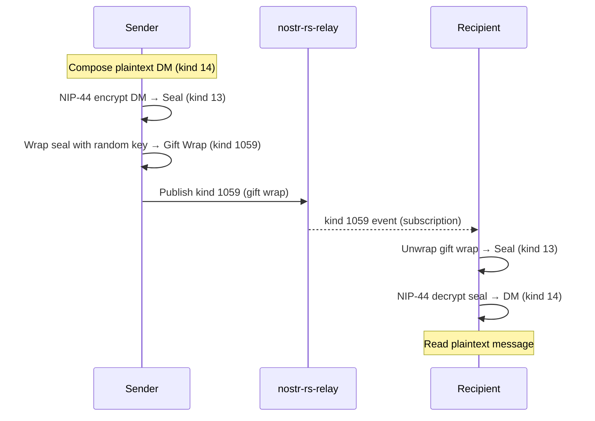

# Direct Messages

## Overview
Direct messages use NIP-17 encrypted DMs with gift-wrap encryption. Messages are end-to-end encrypted so that even the relay operator cannot read them. The flow uses three layers: the plaintext DM (kind 14), a seal (kind 13), and a gift wrap (kind 1059).

## How It Fits
DMs are stored on the nostr-rs-relay as encrypted events. The Next.js app handles encryption/decryption client-side using NIP-44. The relay only sees the outer gift-wrap layer and cannot access message content.

## Key Files
- `app/lib/dm-service.ts` — Encrypt/decrypt DMs, create seals and gift wraps, subscribe to DM events
- `app/lib/nostr.ts` — Kind constants (14, 13, 1059)
- `app/lib/relay-pool.ts` — WebSocket connection pool
- `app/lib/store.ts` — `ChatMessage` and `Channel` interfaces reused for DM conversations

## Architecture

## Status
Implemented — NIP-17 gift-wrapped DMs with NIP-44 encryption.
