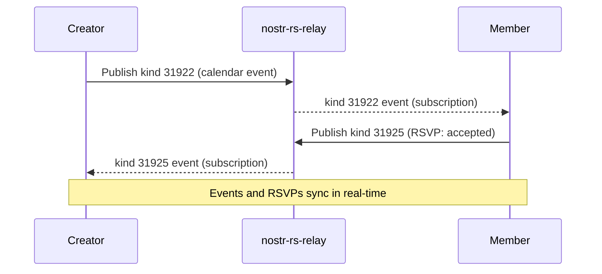

# Calendar

## Overview
Calendar uses NIP-52 for time-based calendar events (kind 31922/31923) and RSVPs (kind 31925). Community members can create events with a title, description, start/end time, and location. Other members can RSVP to events.

## How It Fits
Calendar events are Nostr events stored on the community relay. The Next.js app publishes and subscribes to calendar events client-side via the relay pool. No server-side storage needed — all data is on the relay.

## Key Files
- `app/lib/calendar-service.ts` — Create calendar events, subscribe to events and RSVPs
- `app/lib/nostr.ts` — Kind constants (31922, 31923, 31925)
- `app/lib/relay-pool.ts` — WebSocket connection pool
- `app/lib/store.ts` — `CalendarEvent` interface

## Architecture

## Status
Implemented — event creation, RSVP support, real-time sync.
