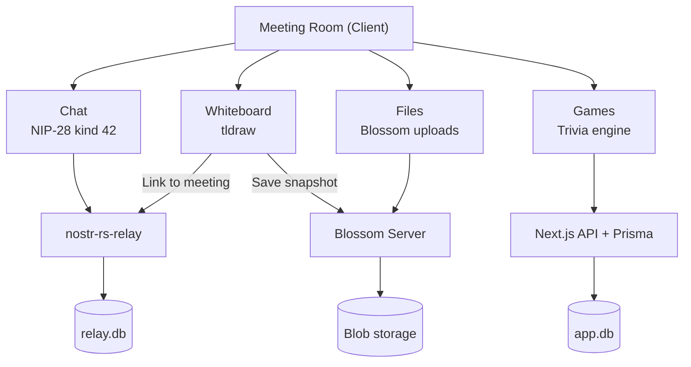

# Meetings

## Overview
Meetings are virtual rooms that combine multiple features: real-time chat, a collaborative whiteboard (tldraw), file sharing, and trivia games. Each meeting is represented as a NIP-28 channel with meeting-specific metadata (status, time, description).

## How It Fits
Meeting metadata and chat are stored on the relay as Nostr events. The whiteboard saves snapshots to Blossom and links them back to the meeting via kind 42 events. Games run through the Next.js API (Prisma-backed). The meeting room is a client-side view that composes these features together.

## Key Files
- `app/lib/meeting-service.ts` — Create meetings, send messages, update status (scheduled/active/ended)
- `app/lib/whiteboard-service.ts` — Save/load whiteboard snapshots via Blossom
- `app/lib/chat-service.ts` — Reused for meeting chat messages
- `app/lib/store.ts` — `Meeting` and `MeetingStatus` interfaces

## Architecture

## Status
Implemented — meeting creation, chat, whiteboard, file sharing, games integration.
