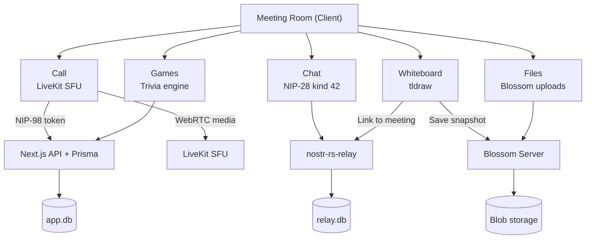

# Meetings

## Overview
Meetings are virtual rooms that combine multiple features: real-time chat, **self-hosted voice/video calls (LiveKit)**, a collaborative whiteboard (tldraw), file sharing, and trivia games. Each meeting is represented as a NIP-28 channel with meeting-specific metadata (status, time, description).

## How It Fits
Meeting metadata and chat are stored on the relay as Nostr events. The whiteboard saves snapshots to Blossom and links them back to the meeting via kind 42 events. Games run through the Next.js API (Prisma-backed). The meeting room is a client-side view that composes these features together.

## Audio/Video Calls
Each meeting room has a **📞 Call** tab backed by a self-hosted LiveKit SFU — no third party, no per-minute billing, running in the same Docker stack as the relay/Blossom/Caddy. Access is gated by a NIP-98-signed token mint (`POST /api/livekit/token`); only registered/whitelisted members get a token. The LiveKit room name maps 1:1 to the `meetingId`. Audio-first by design (mic on, camera off by default) to keep bandwidth sane for 50-300 member communities.

See **[`livekit-meetings.md`](./livekit-meetings.md)** for full architecture, setup (keys/DNS/firewall), and tuning notes.

## Key Files
- `app/lib/meeting-service.ts` — Create meetings, send messages, update status (scheduled/active/ended)
- `app/components/meetings/MeetingCall.tsx` — LiveKit voice/video Call tab UI
- `app/api/livekit/token/route.ts` — NIP-98-gated LiveKit token mint
- `app/lib/whiteboard-service.ts` — Save/load whiteboard snapshots via Blossom
- `app/lib/chat-service.ts` — Reused for meeting chat messages
- `app/lib/store.ts` — `Meeting` and `MeetingStatus` interfaces

## Architecture

## Status
Implemented — meeting creation, chat, voice/video calls (LiveKit), whiteboard, file sharing, games integration.
