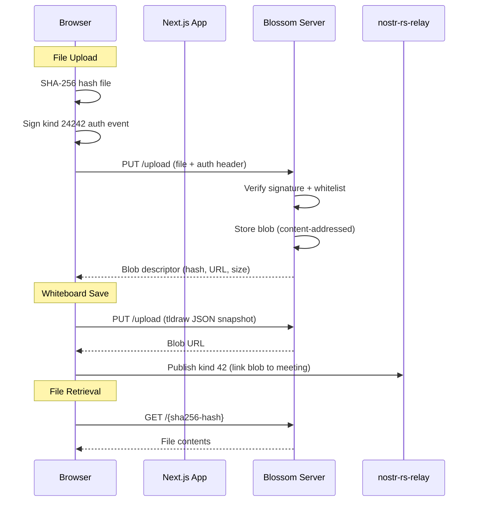

# Files

## Overview
File storage uses the Blossom server with the BUD-02 protocol. Files are content-addressed by SHA-256 hash. Uploads require a kind 24242 Nostr auth event signed by the user's keypair. The app uses Blossom for general file uploads (FilesView) and whiteboard snapshots.

## How It Fits
Blossom runs as a separate Docker container accessible at `files.{domain}`. The Next.js client hashes files locally, creates a signed auth event, and uploads via HTTP PUT. Whiteboard snapshots are saved as tldraw JSON blobs to Blossom, then linked to meetings via kind 42 relay events.

## Key Files
- `app/lib/blossom.ts` — Hash files, create kind 24242 auth events, upload/delete blobs via PUT
- `app/lib/whiteboard-service.ts` — Save whiteboard snapshots to Blossom, publish kind 42 linking blob to meeting
- `config/blossom-config.yml` — Blossom server configuration
- `blossom-server/` — Git submodule of hzrd149/blossom-server

## Architecture

## Status
Implemented — file uploads, whiteboard snapshots, content-addressed retrieval. Admin dashboard at `files.{domain}/admin`.
