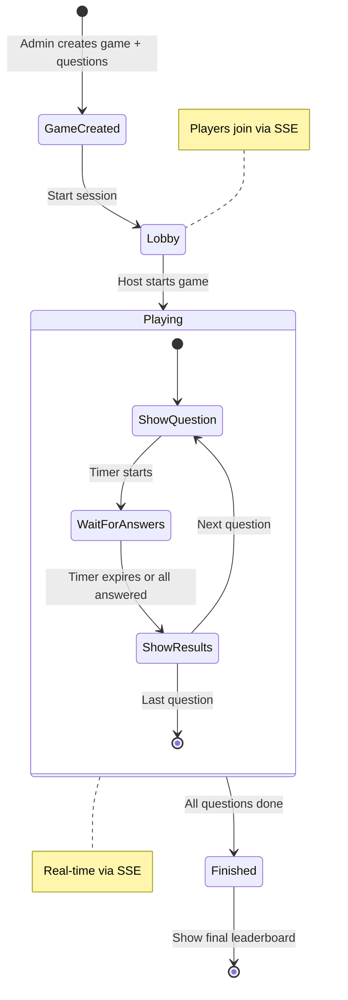

# Games

## Overview
BibleHodl includes a trivia game engine. Admins create games with multiple-choice questions. Players join a session lobby, then answer questions in real-time with scoring based on correctness and response time. Sessions use Server-Sent Events (SSE) for live updates.

## How It Fits
Games are fully server-side — stored in the Next.js app's SQLite database via Prisma. The client communicates through Next.js API routes. Real-time updates (question advancement, scores) are pushed via SSE. Games can be launched standalone or within a meeting room.

## Key Files
- `app/lib/game-service.ts` — Client-side API for fetching/creating games, managing sessions
- `prisma/schema.prisma` — `Game`, `Question`, `GameSession`, `Player`, `Answer` models

## Architecture

## Status
Implemented — game creation, session lifecycle, real-time scoring via SSE.
