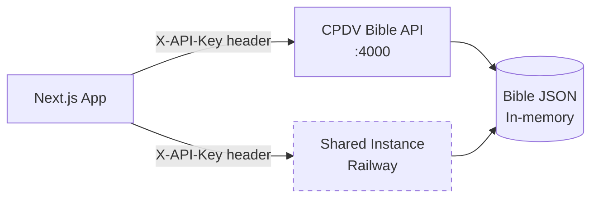

# Bible API

## Overview
The CPDV Bible API provides Bible text for study and game features. It's a standalone Node.js/TypeScript service that loads the full CPDV translation from JSON at boot and serves it via REST endpoints. Communities can use the shared instance on Railway or run their own.

## How It Fits
The Bible API is an optional Docker container in the stack (commented out by default in `docker-compose.yml`). The Next.js app calls it via HTTP with an API key. Most communities point to the shared instance at `cpdv-bible-production.up.railway.app`.

## Key Files
- `docker-compose.yml` — Optional `bible-api` service definition (commented out)
- `.env` — `CPDV_API_URL` and `CPDV_API_KEY` configuration

## Architecture

## Status
Implemented — shared instance live on Railway. Local instance available as optional Docker service.
